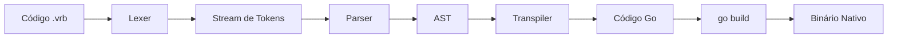
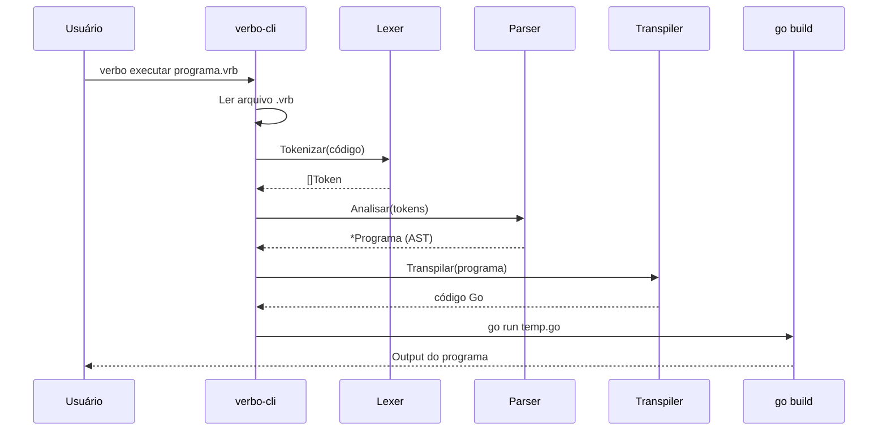

# 🏗️ Arquitetura do Compilador Verbo

## Visão Geral

O compilador Verbo é um **transpiler** que converte código-fonte `.vrb` em código Go compilável. É escrito em Go puro, sem dependências externas.



---

## Componentes

### 1. Lexer (`pkg/lexer/`)

**Responsabilidade**: Converte texto bruto em tokens tipados.

| Arquivo       | Função                                     |
|---------------|---------------------------------------------|
| `token.go`    | Define `TokenType`, `Token`, palavras-chave |
| `lexer.go`    | Scanner UTF-8, tokenização                  |
| `lexer_test.go` | Testes table-driven                      |

**Características**:
- Suporte completo a UTF-8 (acentuação, cedilha)
- Leitura por runa (não por byte)
- Rastreamento de linha/coluna para erros
- Ignorar comentários (`//`)

### 2. AST (`pkg/ast/`)

**Responsabilidade**: Define os nós da Árvore de Sintaxe Abstrata.

| Nó                      | Representa                   |
|-------------------------|------------------------------|
| `Programa`              | Nó raiz                      |
| `DeclaracaoVariavel`    | `A x é 10.`                 |
| `DeclaracaoFuncao`      | `Para Func usando (...):`   |
| `DeclaracaoExibir`      | `Exibir com (...).`         |
| `DeclaracaoSe`          | `Se ... então:`              |
| `DeclaracaoRepita`      | `Repita N vezes:`            |
| `DeclaracaoEnquanto`    | `Enquanto ...:`              |
| `DeclaracaoRetorne`     | `Retorne valor.`             |
| `DeclaracaoAtribuicao`  | `x está novo_valor.`         |
| `ExpressaoBinaria`      | `a + b`, `x menor que y`    |
| `ExpressaoChamadaFuncao`| `Func com (args)`            |

### 3. Parser (`pkg/parser/`)

**Responsabilidade**: Consome tokens e constrói a AST.

**Algoritmo**: Recursive Descent Parsing (descendente recursivo)

**Precedência de expressões**:
1. `analisarExpressao()` → `analisarExpressaoAditiva()`
2. `analisarExpressaoAditiva()` → `analisarExpressaoMultiplicativa()`
3. `analisarExpressaoMultiplicativa()` → `analisarExpressaoPrimaria()`

### 4. Transpiler (`pkg/transpiler/`)

**Responsabilidade**: Converte a AST em código Go válido.

**Mapeamentos principais**:

| Verbo                | Go                          |
|----------------------|-----------------------------|
| `A x é 10.`         | `x := 10`                  |
| `Um y está 0.`      | `y := 0`                   |
| `Exibir com (x).`   | `fmt.Println(x)`           |
| `Repita 5 vezes:`   | `for i := 0; i < 5; i++`   |
| `Se x for menor que y:` | `if x < y`             |
| `Retorne valor.`    | `return valor`              |
| `Para Func usando (x: Inteiro):` | `func Func(x int) interface{}` |

### 5. CLI (`cmd/verbo/`)

**Responsabilidade**: Interface de linha de comando.

| Subcomando   | Ação                                 |
|-------------|---------------------------------------|
| `compilar`  | `.vrb` → `.go` → binário            |
| `executar`  | `.vrb` → `.go` → `go run`           |
| `verificar` | `.vrb` → tokens → AST (sem compilar)|

---

## Estrutura de Diretórios

```
crom-verbo/
├── cmd/verbo/main.go        # CLI entry point
├── pkg/
│   ├── lexer/
│   │   ├── token.go         # Definições de token
│   │   ├── lexer.go         # Scanner léxico
│   │   └── lexer_test.go    # Testes do lexer
│   ├── ast/
│   │   └── ast.go           # Nós da AST
│   ├── parser/
│   │   ├── parser.go        # Parser recursivo
│   │   └── parser_test.go   # Testes do parser
│   └── transpiler/
│       ├── transpiler.go    # Gerador de código Go
│       └── transpiler_test.go # Testes do transpiler
├── examples/                # Programas de exemplo .vrb
├── docs/                    # Documentação
├── tests/                   # Testes de integração
├── Makefile                 # Build automation
├── go.mod                   # Módulo Go
└── README.md                # Documentação principal
```

---

## Pipeline de Compilação


